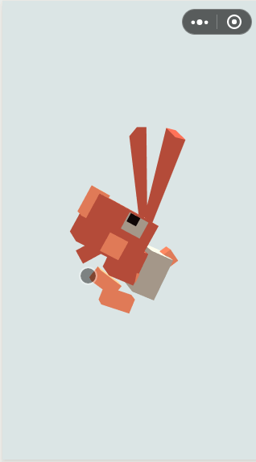

## 微信小游戏示例

## 源码目录介绍
```
./js
│  game.js
│  game.json
│  project.config.json      
│  README.md
│
├─images
│
└─js
    │  main.js
    │
    └─libs
            OrbitControls.js
            symbol.js         //内置适配层，必须
            three.js
            weapp-adapter.js  //内置适配层，必须
```
熟悉three.js的同学，我就不仔细介绍目录的作用了。这里给出一个很简单的demo，在scene中add一个奔跑的兔子。

## issue答疑

项目运行中你可能会遇到以下几类问题。

> 1、TypeError: n.addEventListener is not a function(load Model)

这是因为微信给出的XMLHttpRequest缺少addEventListener，我们在weapp-adapter.js中添加上去，找到XMLHttpResquest的定义部分
```
{
  key: 'addEventListener',
  value: function addEventListener(type, listener) {
    if (typeof listener === 'function') {
      let event = { target: this }
      let that = this
      this['on' + type] = function () {
        listener.call(that, event)
      }
    }
  }
}
```

> 2、交互OrbitControls，一动屏幕就清空

这是因为element.clientWidth/clientHeight微信不支持，改成window.innerWidth/innerHeight就行啦

> 3、真机测试，scene未渲染

这是因为移动端微信的标准是openGL，而非webgl，修改three.js代码。
```
var version = parseFloat( /^(WebGL|OpenGL ES)\ ([0-9])/.exec( gl.getParameter( gl.VERSION ) )[ 1 ] );  
```

> 4、小游戏中暴露了canvas接口，与实际浏览器中three.js开发略有区别

wenbrenderer中需要设置：

```javascript
let ctx = canvas.getContext('webgl');
//···
renderer = new THREE.WebGLRenderer({
        canvas: canvas,
        context: ctx,
        alpha: true,
        antialias: true,
      });
```

## demo

